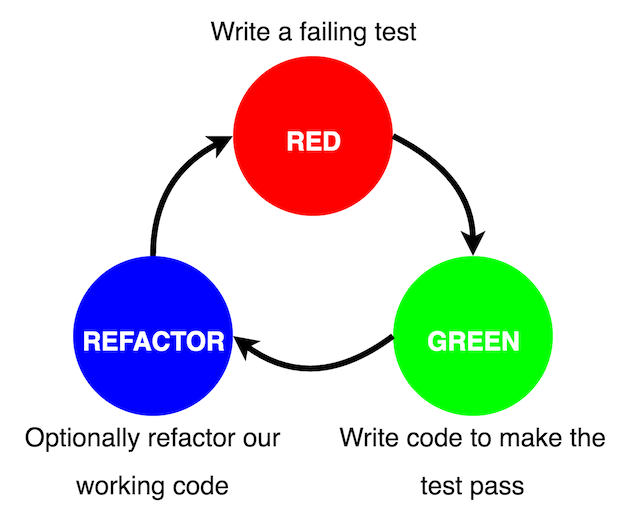
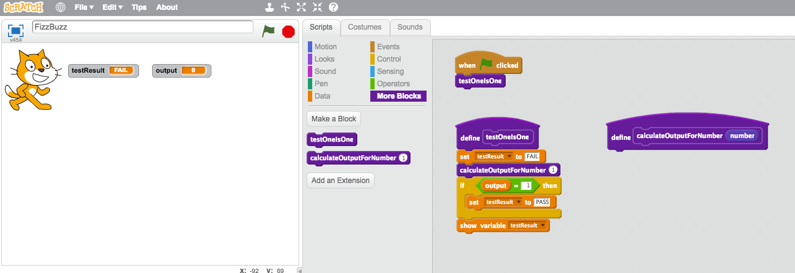
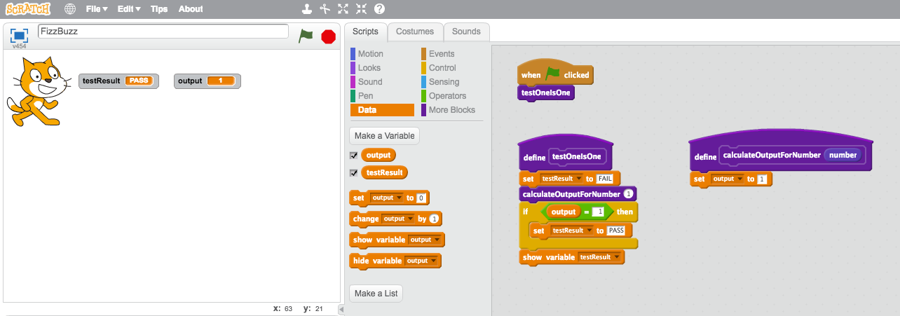
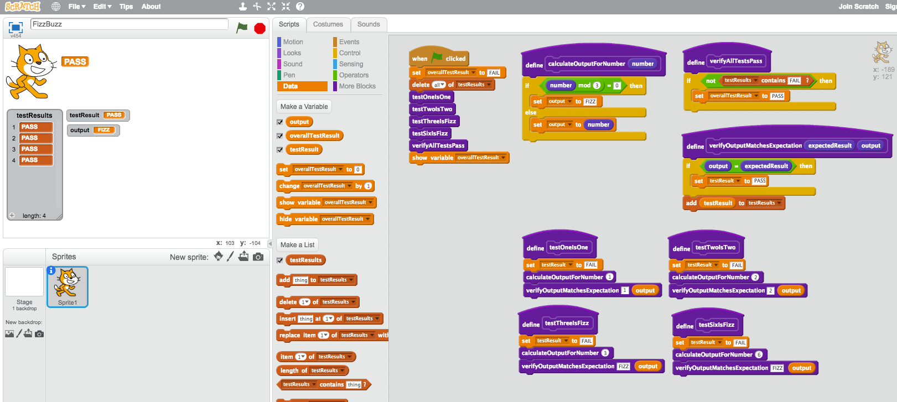
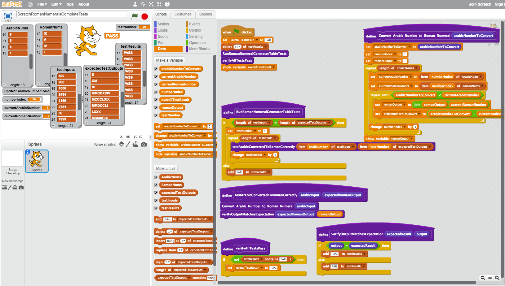

# ScratchTDD

Can you TDD in Scratch?

## Overview

In our team, we use a Test-Driven Development (TDD) approach when writing code. I'm a supporter of this approach and its many benefits. I won't go into the benefits here — you can [Google many articles on the subject](https://www.google.co.uk/search?q=test%20driven%20development) (other search providers are available).

[Scratch](https://scratch.mit.edu), from MIT, is essentially a visual programming environment that _"helps young people learn to think creatively, reason systematically, and work collaboratively — essential skills for life in the 21st century"_. There's a growing movement around teaching kids to code, that will hopefully play an important part in solving the skills and diversity shortages our industry has.

One day, the crazy thought popped into my head: _"Can you TDD in Scratch?"_. I did a brief Google, and couldn't find any examples of TDD in Scratch.

So, in my "10% time", I looked into doing the [Roman Numerals Kata](http://codingdojo.org/kata/RomanNumerals/) in Scratch. On my first attempt, I cheated a little and implemented the algorithm first and then put a test around it (this _isn't_ TDD).


This at least proved that it is possible to separate my algorithm logic and have tests around it. So next I decided to do some actual TDD in Scratch...

## Basic TDD

Let's start with a proof that we can do basic TDD in Scratch by writing a test first, and writing some code to make it pass. Remembering the basics of TDD: that we'll follow a _"Red -> Green -> Refactor"_ feedback loop.



For this example, we'll TDD a very simple function that takes a name as an input, and outputs a greeting containing that name. For example:

_"Hello, Ross. Isn't TDD fun?"_

First of all, let's create an empty test. I've created it as a "block", which is analogous to a function or method in other programming/scripting languages.

This sets a global variable `testResult` to "FAIL" and shows it. I've arranged it so it looks a little like the Scratch Cat says the result.


Next let's write the actual failing test. I've set a testInputName of "Ross", an expected greeting of "Hello, Ross. Isn't TDD fun?". It then calls our — for now, empty — `Greeter` block, which takes a `name` as an input parameter.


Now that we have a failing test that describes the behaviour we want from our program, we can write some code in `Greeter` to make the test pass...


Voilà! We have a passing test that proves that the `Greeter` function gives us the correct greeting.

We could optionally refactor at this stage — that is, change our code without modifying its overall behaviour — to make it tidier, more readable etc, safe in the knowledge that our test will tell us if we have broken it, or if it still works as expected.

We could also write some more tests to check that the program works with different names.

But now that we've proven the basic premise of TDD in Scratch, let's move onto a real problem.

## FizzBuzz

### The problem

[FizzBuzz is a common coding kata](http://codingdojo.org/kata/FizzBuzz/). It is usually posed as such:

Write a program that prints the numbers from 1 to 100. But for multiples of three print "Fizz" instead of the number and for the multiples of five print "Buzz". For numbers which are multiples of both three and five print "FizzBuzz".

For example:
```
1
2
Fizz
4
Buzz
Fizz
7
8
Fizz
Buzz
11
Fizz
13
14
FizzBuzz
16
17
Fizz
19
Buzz
[... etc up to 100]
```

Let's explore the problem using TDD, and just write the function ("block") that decides what to output for each input number.

### Start with some basic tests






### Refactor

#### Extract Descriptive Blocks (Functions/Methods)



#### Table Testing


### Buzzin'


### FizzBuzz!


### Refactoring Safely


## Revisiting Roman Numerals


