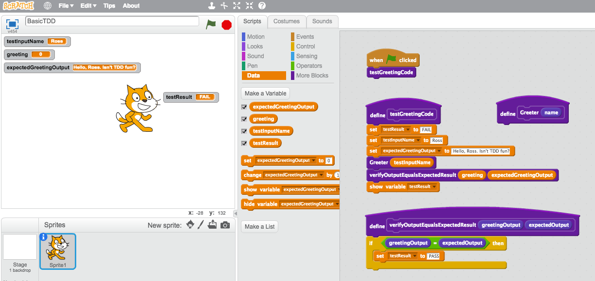
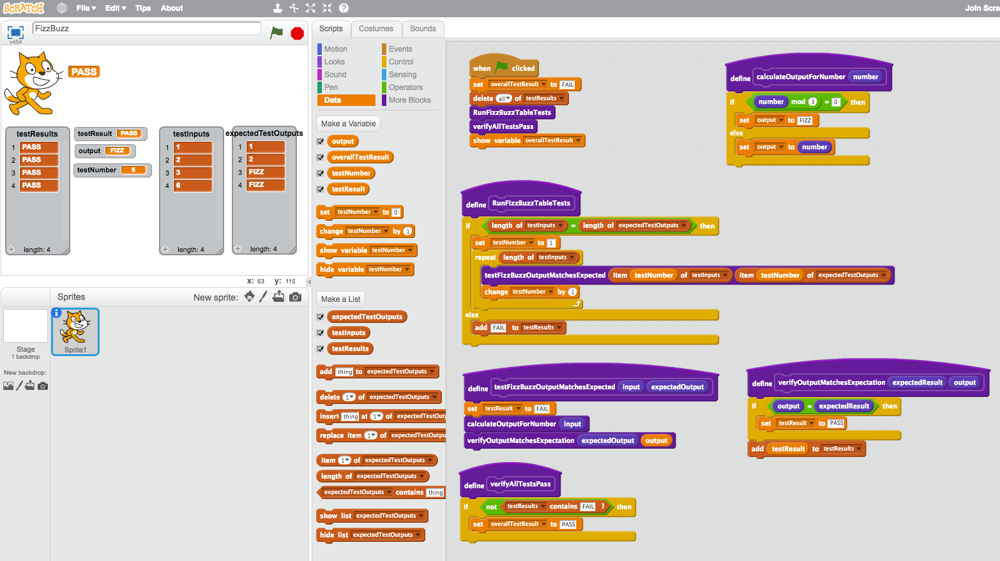
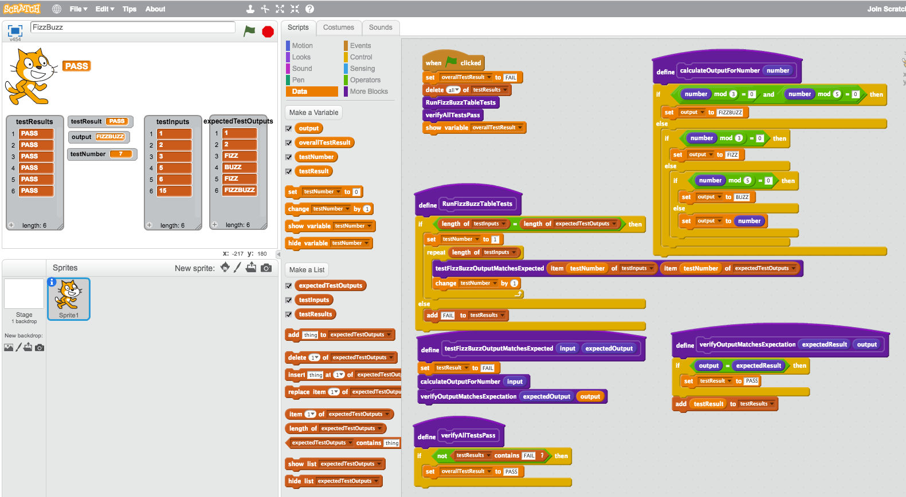
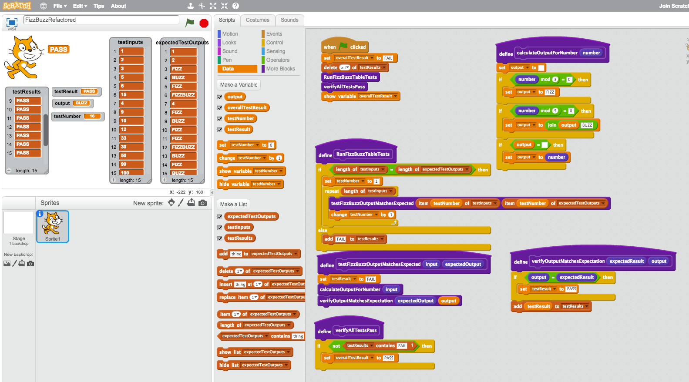

# ScratchTDD

Can you TDD in Scratch?

TL;DR: yes, you can!

## Overview

In our team, we use a Test-Driven Development (TDD) approach when writing code. I'm a supporter of this approach and its many benefits. I won't go into the benefits here — you can [Google many articles on the subject](https://www.google.co.uk/search?q=test%20driven%20development) (other search providers are available).

[Scratch](https://scratch.mit.edu), from MIT, is essentially a visual programming environment that _"helps young people learn to think creatively, reason systematically, and work collaboratively — essential skills for life in the 21st century"_. There's a growing movement around teaching kids to code, that will hopefully play an important part in solving the skills and diversity shortages our industry has.

One day, the crazy thought popped into my head: _"Can you TDD in Scratch?"_. I did a brief Google, and couldn't find any examples of TDD in Scratch.

So, in my "10% time", I looked into doing some TDD in Scratch. For my first experiment, I implemented the algorithm for the [Roman Numerals Kata](http://codingdojo.org/kata/RomanNumerals/). I cheated a little here, by implementing the algorithm first and then put a test around it afterward (this _isn't_ TDD!).


This at least proved that it is possible to separate my algorithm logic and have tests around it. So next I decided to do some actual TDD in Scratch...

## Basic TDD

Let's go back to basics and start with a proof that we can do TDD in Scratch by writing a test first, and writing some code to make it pass. Remembering the basics of TDD: that we'll follow a _"Red -> Green -> Refactor"_ feedback loop.


For this example, we'll TDD a very simple function that takes a name as an input, and outputs a greeting containing that name. For example:

_"Hello, Ross. Isn't TDD fun?"_

First of all, let's create an empty test. I've created it as a "block", which is analogous to a function or method in other programming/scripting languages.

This sets a global variable `testResult` to "FAIL" and shows it. I've arranged it so it looks a little like the Scratch Cat says the result.


Next let's write the actual failing test. I've set a testInputName of "Ross", an expected greeting of "Hello, Ross. Isn't TDD fun?". It then calls our — for now, empty — `Greeter` block, which takes a `name` as an input parameter.

The test fails, as expected, because we didn't get our expected result.



Now that we have a failing test that describes the behaviour we want from our program, we can write some code in `Greeter` to make the test pass...


Voilà! We have a passing test that proves that the `Greeter` function gives us the correct greeting.

We could optionally refactor at this stage — that is, change our code without modifying its overall behaviour — to make it tidier, more readable etc, safe in the knowledge that our test will tell us if we have broken it or if it still works as expected.

We could also write some more tests to check that the program works with different names.

But now that we've proven the basic premise of TDD in Scratch, let's move onto a real problem.

## FizzBuzz

### The problem

[FizzBuzz is a common coding kata](http://codingdojo.org/kata/FizzBuzz/). It is usually posed as such:

Write a program that prints the numbers from 1 to 100. But for multiples of three print "Fizz" instead of the number and for the multiples of five print "Buzz". For numbers which are multiples of both three and five print "FizzBuzz".

For example:
```
1
2
Fizz
4
Buzz
Fizz
7
8
Fizz
Buzz
11
Fizz
13
14
FizzBuzz
16
17
Fizz
19
Buzz
[... etc up to 100]
```

Essentially, this boils down to:
- if a number is divisible by 3, say "FIZZ"
- if a number is divisible by 5, say "BUZZ"
- if a number is divisible by 3 _AND_ 5, say "FIZZBUZZ"
- for all other numbers, say the number.

Let's explore the problem using TDD, and just write the function ("block") that decides what to output for each input number.

### Start with some basic tests

Let's start with a simple failing test `testOneIsOne` that tests that for an input of `1`, the output is `1`...


Make it pass by simply returning `1` from our `calculateOutputForNumber` block.


Simply returning `1` isn't going to work for all numbers for FizzBuzz, so we should start to explore building out our algorithm by picking another test scenario and writing a failing test for it.

Let's write a failing test for the number `2`.


And make it pass...


But, uh oh, there's a problem. I've made it pass by changing the output to `2`. And our `testResult` is saying "PASS". But _really_ `testOneIsOne` is failing. Our second test result for `testTwoIsTwo` is overwriting it.

So, I refactored my test code a bit so that each individual test now adds its result to a list of `testResults`. We then have another block, `verifyAllTestsPass` that checks for any failures and sets our `overallTestResult` to "PASS" if there are none.


That's better, it now correctly tells us that the first test is failing, as is the overall suite of tests. So let's fix our code.

We'll just set the input `number` as the `output` for now...


Next, let's add a test to check that an input of `3` returns "FIZZ". This will force us to build some more of our algorithm. Here, we simply check if the number is `3` and set the `output` to "FIZZ" if it is, or the input `number` if it is not.


We know that's not good enough. All numbers that are divisible by 3 should say "FIZZ". Let's add another test for `6`, and change our code so that when the number is divided by 3, and the remainder is 0, we say "FIZZ". We'll use the [modulo operator](https://en.wikipedia.org/wiki/Modulo_operation) for that — this effectively tells us that the input number is _wholly_ divisible by 3.


### Refactor

So far, we've largely skipped the opportunity to refactor either our code or our tests. However, our tests are beginning to look a little repetitive. They look the same, do the same thing, but with differnet inputs and expected outcomes. Let's refactor...

#### Extract Descriptive Blocks (Functions/Methods)

Firstly, I'd like to extract the test verification to a block that has a descriptive name.


Now that verification code only exists in one place, and we can _resuse_ it.

But our tests still look a little repetitive...

#### Tabular Tests

This looks like a good candidate for a "tabular test", sometimes referred to as a parameterised test. Simply put, we want to have a table of input values, and expected output values.

I've implemented this in Scratch with two _lists_: `testInputs` and `expectedTestOutputs`.

I've refactored the test code so that we now have `RunFizzBuzzTableTests`, which:
1. ensures the number of inputs match the number of expected outputs
- iterates over the list of inputs
- executes `testFizzBuzzOutputMatchesExpected` for each test input. This block does the individual test to calculate the output and verify that it matches the expected output.



### Buzzin'

Now we can easily add tests by simply adding pairs of test inputs and expected outputs to our test lists.

Let's add a test for `5` being "BUZZ". It will fail initially.


And then modify our algorithm to correctly output "BUZZ" for a number divisible by 5...


### FizzBuzz!

We've almost covered all of our main scenarios. What about "FIZZBUZZ"?

Simply add a test case to the table, and make it pass...



What about more scenarios? Let's put a bunch of numbers and the expected outcomes in.

We wont be _exhaustive_ with our test cases — testing literally every possible input and output. Whether and when you should do that is a topic that I wont go into here. For now we'll just put in a bunch of scenarios that give us enough coverage to give us the confidence that our algorithm works.


### Refactoring Safely

One of the great things that comes with having a well tested codebase, is the ability to refactor safely. We can change the internals of our algorithm, knowing that we have a test suite that can verify that we have not broken its behaviour in terms of its inputs and expected outputs.

Let's try that out. At the moment, the algorithm consists of three nested if-else conditional blocks. Let's change it to something simpler.

Instead, we'll do the following:
1. start with `output` as an empty string.
2. if the `number` is divisible by 3, add "FIZZ" to the `output`.
3. next, if the `number` is divisible by 5, then add "BUZZ" to the `output`. This should automagically give us "FIZZBUZZ" for the cases where `number` is divisible by 3 _and_ 5.
4. Finally, if the `output` string is still empty, set it to the input `number`.

We can make our changes, then re-run the test suite to confirm that it still works.

The cat says PASS...



So there it is. We've implemented the core algorithm of FizzBuzz, in Scratch, using a Test-Driven Development approach. It can be done.

## Revisiting Roman Numerals

After I'd proven that I could TDD in Scratch, I decided to go back to my Roman Numerals example. I already had the algorithm, but I decided to wrap a set of tabular tests around it to confirm it worked.

I mostly repeated much of what I'd done for FizzBuzz, and copied the test data from a [previous attempt to do this kata in Kotlin](https://github.com/rossharper/RomanNumerals-Kotlin).


## Next Steps

At this point I've run out of time today to explore this further. I'd maybe explore how I separate program code and test code in Scratch and have an interface that _does the thing_ e.g. input an Arabic number, have the cat say the Roman numerals, then a separate button for running the test suite.

But, I think I'll leave it there. It was an interesting challenge. But, in summary...

Can you do TDD in Scratch? Yes, you can.
